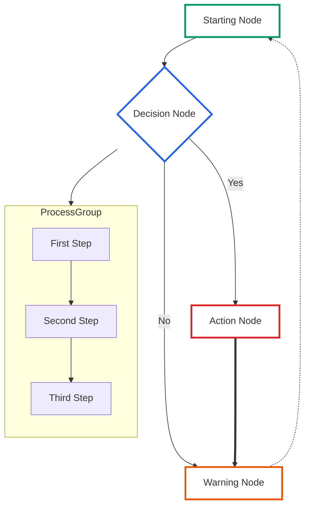

# Markdown Formatting Reference

This document provides copy-ready snippets for common formatting elements used in Azure Local Supportability documentation. It is a reference authoring aid, not an article template. Copy the sections you need into a troubleshooting guide, how-to guide, reference, overview, or deep dive. In this file, TSG means troubleshooting guide.

Use text labels in addition to any visual styling. Do not use icons as the only status signal.

---

## Table of Contents

- [Article metadata marker](#article-metadata-marker)
- [Applicable products and supported versions](#applicable-products-and-supported-versions)
- [Risk and safety labels](#risk-and-safety-labels)
- [Prerequisites and stop gates](#prerequisites-and-stop-gates)
- [Author assembly checklist](#author-assembly-checklist)
- [Complete action pattern](#complete-action-pattern)
- [Expected output and validation](#expected-output-and-validation)
- [Where this appears](#where-this-appears)
- [Test automation metadata](#test-automation-metadata)
- [Owner, impact, and handoff snippets](#owner-impact-and-handoff-snippets)
- [Worked safe-action and rollout snippets](#worked-safe-action-and-rollout-snippets)
- [Evidence, glossary, and validation snippets](#evidence-glossary-and-validation-snippets)
- [Alert and emphasis boxes](#alert-and-emphasis-boxes)
- [Mermaid Markdown diagrams and flow charts](#mermaid-markdown-diagrams-and-flow-charts)
- [Optional HTML callout boxes](#optional-html-callout-boxes)
- [Code blocks](#code-blocks)
- [Tables](#tables)
- [Status labels](#status-labels)

---

## Article metadata marker

Article templates and finished articles should include exactly one HTML-comment JSON marker. Keep this marker near the top of the article, then replace the placeholder values. Component README and CONTRIBUTING templates should require and index this marker, but should not embed article metadata themselves.

````markdown
<!-- tsg-metadata
{
  "schema": "azure-local-supportability/tsg-metadata/v1",
  "document_type": "replace-me",
  "products": ["replace-me"],
  "detector": {"type":"none","signal":null},
  "validation": {"fidelity_level":"L0","technical_grade":null,"reproduction_substrate":"none","automation_status":"not-assessed","last_validated":null,"spec_ref":""}
}
-->
````

Validate the completed marker against [`tsg-metadata.schema.json`](./tsg-metadata.schema.json). Keep `validation.technical_grade` as JSON `null` until TSG-FORGE produces `A`, `B`, `C`, or `F` with report or spec evidence. When `detector.type` is `none`, keep `detector.signal` as JSON `null`. When an author selects a real detector, such as `envchecker`, `eventlog`, or `command`, they must set both `detector.type` and `detector.signal` together.

---

## Applicable products and supported versions

Use this table whenever guidance depends on product, release, hardware, or operation phase. Be explicit about supported versions and out-of-scope cases.

```markdown
## Applicable products

| Product | Supported versions | Scope | Out of scope | Source |
| --- | --- | --- | --- | --- |
| Azure Local | <supported Azure Local version or solution build> | <deployment, add node, update, upgrade, or runtime> | <older builds, newer builds, or unrelated components> | <public Microsoft Learn link or product-emitted evidence> |
| <original equipment manufacturer (OEM) or component, if applicable> | <firmware, driver, or software version> | <node, cluster, switch, baseboard management controller (BMC), disk, or workload> | <unsupported hardware or configuration> | <public Microsoft link or product-emitted evidence> |
```

---

## Risk and safety labels

Use `[READ-ONLY]` for steps that do not change state. It is not a risk label. When an action may change state, use one of the canonical risk labels and replace the placeholders with the actual impact, gate, and rollback for the article.

```markdown
## Risk and safety

> [!WARNING]
> [<READ-ONLY|LOW RISK|MEDIUM RISK|HIGH RISK>] This action changes <state, service, configuration, workload placement, or firmware>, or is read-only. Expected impact: <none, brief reconnect, workload failover, reboot, or downtime>. Do not continue unless <precondition> is true, <required privilege> is present, <maintenance window or approval> is satisfied for the workload impact, and <rollback or backup> is available.

| Label | When to use | Required pre-check | Required privilege | Workload or maintenance gate | Stop condition | Rollback |
| --- | --- | --- | --- | --- | --- | --- |
| [READ-ONLY] | Non-mutating detection or validation only | <command or observable condition> | <least privilege required> | <none, or state why no maintenance window is needed> | <what means do not proceed> | Not applicable because no state changes |
| [LOW RISK] | Reversible changes with no expected workload impact | <command or observable condition> | <least privilege required> | <none, or state why no maintenance window is needed> | <what means do not proceed> | <how to return to the prior state> |
| [MEDIUM RISK] | Reversible state changes that can interrupt management, networking, or workload placement | <command or observable condition> | <least privilege required> | <approval or maintenance window needed before action> | <what means do not proceed> | <how to return to the prior state> |
| [HIGH RISK] | Firmware, reboot, destructive cleanup, storage, quorum, or workload-impacting actions | <command or observable condition> | <least privilege required> | <approved maintenance window and workload-owner notification> | <what means do not proceed> | <how to return to the prior state or escalate> |
```

---

## Prerequisites and stop gates

Use this table before any action pattern. The reader should know what to check, what success looks like, and when to stop.

```markdown
## Prerequisites

| Requirement | How to confirm | Expected result | Stop if not met |
| --- | --- | --- | --- |
| Administrative PowerShell on an Azure Local node | `whoami /groups` | The required admin group is present | Escalate to a cluster administrator |
| Maintenance window, if workloads may move or restart | <change record, approval, or customer confirmation> | The window covers the expected impact | Schedule the change first |
| Current state captured | Save the output from the pre-check command | Output is attached to the case or pull request (PR) | Do not run the action until current state is recorded |
```

---

## Author assembly checklist

Use this checklist before copying snippets into an article. It keeps article authors from guessing which sections are required for each document type.

| Document type | Required snippet blocks | Optional snippet blocks | Fast path placement |
| --- | --- | --- | --- |
| Troubleshooting guide | Metadata marker, applicable products, risk and safety, prerequisites, where this appears, complete action pattern, expected output, verify the fix, evidence bundle | Owner handoff, workload impact, OEM boundary, multi-node rollout | Put the fastest safe diagnosis and stop gate before deeper explanation |
| How-to guide | Metadata marker, applicable products, prerequisites, risk and safety, complete action pattern, expected output, rollback, verification | Workload impact, rollout table, customer summary | Put the top three actions before background information |
| Reference article | Metadata marker, applicable products, supported versions, defaults, constraints, expected output, validation command | Glossary, owner handoff, evidence bundle | Put required settings and supported versions before examples |
| Overview | Metadata marker, applicable products, owner and impact summary, customer-facing summary, scope, next action | Glossary, handoff table | Put the reader decision and owner first |
| Deep dive | Metadata marker, applicable products, glossary, evidence, validation command, operational boundaries | Workload impact, OEM boundary, rollout table | Put the mechanism summary before detailed internals |

Use this fast-path table when the reader needs the shortest safe path before the full article.

| Step | Prompt to fill | Stop gate | Revalidation |
| --- | --- | --- | --- |
| 1. Confirm scope | Product, supported version, node or site, and owner | Stop if the product or version is out of scope | Record the scope in the evidence bundle |
| 2. Run read-only detection | The command or portal check that proves the issue exists | Stop if the output is healthy, empty when empty is healthy, or inconclusive | Save the exact output and timestamp |
| 3. Choose the action | The risk-labeled action, privilege, workload gate, maintenance window, rollback, and escalation owner | Stop if rollback is unavailable, privilege is missing, workload approval is missing, or maintenance gating is unresolved | Run the verification command and record pass or fail |

---

## Complete action pattern

Every generated action pattern should prompt for pre-check, action, expected result or output, stop condition, rollback, and verification.

````markdown
## Action: <short action name>

> [!WARNING]
> [<READ-ONLY|LOW RISK|MEDIUM RISK|HIGH RISK>] <Explain the impact in one sentence. Use READ-ONLY only when no state changes.>

### Privilege and workload gate

| Gate | Required value |
| --- | --- |
| Required privilege | <least privilege role or local group> |
| Workload impact | <none, live migration, pause, restart, drain, or downtime> |
| Maintenance or approval gate | <not required, approval required, or approved maintenance window> |
| Escalation owner | <role or team to contact if a stop condition is hit> |

### Pre-check

Run this before changing state.

```powershell
 # Read the current state.
<read-only command>
```

Expected output:

```console
<Field>    <Expected healthy or actionable value>
```

Stop if: <condition that means the action is unsafe, out of scope, or already complete>.

### Action

Run this only after the pre-check matches the expected state.

```powershell
 # Change only the documented state.
<state-changing command>
```

Expected result:

```console
<success message, status field, or changed value>
```

### Rollback

Use this if the action fails, the expected result does not appear, or the customer requests backout.

```powershell
 # Restore the prior state captured in the pre-check.
<rollback command>
```

Expected rollback output:

```console
<status field, restored value, or success message>
```

Rollback verification:

```powershell
<read-only rollback verification command>
```

Resume only if: <rollback verification output confirms the prior state is restored>.

### Verification

Re-run the detection command and confirm the healthy output.

```powershell
<read-only verification command>
```

Pass criteria: <exact field or result that means the issue is resolved>.
Fail criteria: <exact field or result that means escalation is required>.
Escalation: <role or team to contact, with the evidence bundle attached>.
````

---

## Expected output and validation

Show the reader what success, failure, empty output, and inconclusive output mean for the specific check.

````markdown
## Expected output

Healthy output:

```console
Name                         Status     Detail
<check-or-resource-name>     Success    <healthy detail text>
```

Unhealthy output:

```console
Name                         Status     Detail
<check-or-resource-name>     Failure    <actionable failure detail text>
```

No output means: <healthy, unhealthy, inconclusive, or not applicable for this check>.

## Verify the fix

1. Re-run the same detection command used in the diagnosis section.
2. Confirm the result matches the healthy output above.
3. If the issue was discovered during pre-update validation, re-run the documented health check, for example `Invoke-SolutionUpdatePrecheck -SystemHealth`, then confirm `Get-SolutionUpdateEnvironment` shows `HealthState` as `Success`.
4. If validation still fails, collect the evidence listed in the detection surfaces table and escalate with the before and after output.
````

---

## Where this appears

Use this table to document administrator detection surfaces. Use only these states: `shown`, `not-evident`, and `absent`. `shown` means the surface displays the issue. `not-evident` means the surface was actually checked with a named command, blade, log, time window, timestamp, or freshness proof and did not display the issue. `absent` means the surface has not been characterized yet, so treat it as a draft work item rather than a publishable final state for troubleshooting content.

```markdown
## Where this appears

| Surface | State: shown, not-evident, or absent | What to look for | Evidence and freshness required for shown or not-evident |
| --- | --- | --- | --- |
| PowerShell on an Azure Local node | <shown/not-evident/absent> | <cmdlet and key field> | <command, output, node scope, and timestamp> |
| Azure portal | <shown/not-evident/absent> | <blade, health state, or update precheck result> | <blade name, status text, and screenshot or timestamp> |
| Windows event logs | <shown/not-evident/absent> | <log, provider, Event ID, and message fragment> | <log query, time window, latest event time, and result count> |
| Cluster logs, `Get-ClusterLog` | <shown/not-evident/absent> | <event or state, or state that the issue is not logged there> | <cluster log command, time window, and result count> |
| Failover Cluster Manager | <shown/not-evident/absent> | <role, resource, node state, or why the surface is not-evident> | <view checked and timestamp> |
| Windows Admin Center, standalone | <shown/not-evident/absent> | <view or why the surface is not-evident> | <view checked and timestamp> |
| Windows Admin Center in Azure portal | <shown/not-evident/absent> | <view or why the surface is not-evident> | <view checked and timestamp> |
| Component or tool log files | <shown/not-evident/absent> | <path to the tool log or report file> | <path, file modified time, excerpt, and result count> |
```

---

## Test automation metadata

Use this block when a troubleshooting guide (TSG) has been linted or live-tested by TSG-FORGE. Keep customer identifiers, cluster names, IP addresses, subscription IDs, and tenant-specific values out of public files.

````markdown
## Test automation metadata

```json
{
  "schema": "azure-local-supportability/tsg-metadata/v1",
  "document_type": "troubleshoot",
  "products": ["Azure Local"],
  "detector": {"type":"none","signal":null},
  "validation": {
    "fidelity_level": "L0",
    "technical_grade": null,
    "reproduction_substrate": "none",
    "automation_status": "not-assessed",
    "last_validated": null,
    "spec_ref": ""
  }
}
```
````

Use these compact rubrics when filling the schema fields and companion evidence. Record execution surface, loop steps, report links, and evidence in the article body, PR description, or companion spec rather than adding out-of-schema fields to the marker.

| Field | Values | Meaning |
| --- | --- | --- |
| `document_type` | deep-dive, how-to, overview, reference, troubleshoot | Use the token that matches the article template filename. Do not use display names such as Deep Dive or How To inside the JSON marker. |
| `detector.type` | command, control-plane, envchecker, eventlog, feature, manual, none, portal, registry, service, telemetry | Use `none` only when the article has no detector. When using `none`, `detector.signal` must be JSON `null`. |
| `fidelity_level` | L0, L1, L2, L3, L4 | L0 means static lint or persona review only. L1 means read-only diagnostics were run. L2 means a faithful detector, proxy, or synthetic input was tested. L3 means the real mechanism was tested on a scratch or isolated object. L4 means the full genuine inject, detect, mitigate, and revalidate loop passed. |
| `technical_grade` | null, A, B, C, F | This is the authoritative technical grade field. Use JSON `null` until TSG-FORGE produces A, B, C, or F with report or spec evidence. |
| `automation_status` | not-assessed, scaffold, ready, proven, blocked, manual | Test readiness. Use not-assessed before review, scaffold when planned but not implemented, ready when automation exists but is not proven, proven when it has passed with evidence, blocked when automation cannot proceed yet, and manual when a human must verify. |
| `execution_surface` | on-device, mixed, cloud-diagnostic, cloud-control, thin | Runtime location. This is separate from `automation_status`: on-device runs on a node, mixed uses node plus cloud checks, cloud-diagnostic depends on cloud telemetry, cloud-control changes connected Azure state, and thin has no executable diagnostic or action. |

```markdown
## Validation evidence

| Field | Value |
| --- | --- |
| Execution surface | <on-device, mixed, cloud-diagnostic, cloud-control, or thin> |
| TSG-FORGE report | <report path or PR link> |
| Companion spec | <spec path or empty if not applicable> |
| Loop evidence | <baseline, inject, detect, mitigate, and revalidate results, or not applicable> |
| Freshness | <validation date, report timestamp, or reason freshness is not applicable> |
```

---

## Owner, impact, and handoff snippets

Use this compact set when the article needs a decision owner, customer context, workload impact, or a handoff boundary.

| Snippet | Copy-ready prompt |
| --- | --- |
| Owner and impact summary | State the business impact, technical owner, customer-visible impact, expected duration, downtime risk, and escalation path in one paragraph. |
| Customer-facing summary | In plain language, state the current state, who owns the next action, what will happen next, expected timing, and what the customer can safely do while waiting. |
| Owner handoff | Record the primary owner, secondary owner, evidence already collected, evidence still needed, and the condition that transfers ownership. |
| Workload impact | State whether VMs move, live migrate, pause, restart, drain, or experience downtime. Name the required approval and maintenance window. |
| OEM boundary | State the hardware evidence, firmware or driver target, owner, and the signal that this is not an OEM action. |
| Accessibility context | Explain why the step matters, who it helps, what risk it avoids, and the safe next action for a reader who cannot perform the change. |

```markdown
## Owner, impact, and handoff

| Field | Value |
| --- | --- |
| Business or customer impact | <plain-language impact> |
| Primary owner | <customer IT, partner or system integrator (SI), original equipment manufacturer (OEM), Microsoft Customer Service and Support (CSS), or product group> |
| Secondary owner or handoff target | <team or role> |
| Expected duration | <time estimate or not known> |
| Downtime or workload risk | <none, live migration, reboot, drain, or outage> |
| Approval required | <none, change record, maintenance window, or customer approval> |
| Evidence collected | <commands, logs, screenshots, timestamps, and validation output> |
| Escalation path | <who to contact and what evidence to include> |
```

---

## Worked safe-action and rollout snippets

Use a filled safe-action example when readers may not know how to replace placeholders. This example is read-only, so rollback records that no state changed.

### Filled safe-action example

| Contract field | Filled example |
| --- | --- |
| Label | [READ-ONLY] |
| Required privilege | User rights sufficient to run read-only PowerShell DNS queries on the node. |
| Workload or maintenance gate | No workload impact and no maintenance window required because this is read-only. |
| Pre-check | Confirm PowerShell can resolve a public Microsoft endpoint from the node. |
| Action | Run `Resolve-DnsName -Name "management.azure.com" -ErrorAction Stop`. |
| Expected output | Output includes `Name` set to `management.azure.com` and at least one returned record. |
| Stop condition | Stop if the command returns an error or no record. Do not continue to a DNS mitigation until the failing output is saved. |
| Rollback | No rollback is required because this example is read-only and changes no state. Expected rollback output is not applicable. |
| Rollback verification | Not applicable because no state changed. |
| Verification | Re-run the same command after any DNS remediation and compare the before and after output. |
| Escalation | Escalate to the network or DNS owner with the before and after output if verification still fails. |

```powershell
$ErrorActionPreference = "Stop"
Resolve-DnsName -Name "management.azure.com" -ErrorAction Stop
```

```console
Name                                           Type   TTL   Section    IPAddress
management.azure.com                          A      60    Answer     20.50.2.1
```

Use this rollout table when a guide applies to more than one node, cluster, or site.

```markdown
## Rollout plan

| Target | Run order | Parallelism rule | Pre-check evidence | Result | Validation evidence |
| --- | --- | --- | --- | --- | --- |
| <site or node 1> | 1 | <serial or parallel with safe peer set> | <before output and timestamp> | <pass, fail, or skipped> | <after output and timestamp> |
| <site or node 2> | 2 | <serial or parallel with safe peer set> | <before output and timestamp> | <pass, fail, or skipped> | <after output and timestamp> |
```

---

## Evidence, glossary, and validation snippets

Use this section to make escalation and validation repeatable.

### Evidence bundle

```markdown
## Evidence bundle for escalation

| Evidence | Required detail |
| --- | --- |
| Detection command output | Exact command, output, node name redacted if needed, and timestamp |
| Expected output comparison | Healthy output, observed output, and why the result is pass, fail, empty, or inconclusive |
| Windows event logs | Log name, provider, Event ID, message fragment, and timestamp |
| Component or tool logs | File path, relevant excerpt, and collection time |
| Azure portal or Windows Admin Center screenshot | Blade name, status text, timestamp, and any redacted identifiers |
| Rollback or mitigation result | Command, expected result, actual result, and timestamp |
| Final verification | Revalidation command, output, pass or fail result, and next owner |
```

### Glossary

| Term | Meaning |
| --- | --- |
| TSG | Troubleshooting guide. |
| TSG-FORGE | The template and troubleshooting-guide validation harness used to lint, grade, and, when applicable, live-test a guide. |
| Detector | The source that proves the issue exists, such as envchecker, eventlog, command, service, feature, registry, telemetry, manual, or control-plane. |
| envchecker | An Environment Validator detector that reads Azure Local validator results. |
| Fidelity level | How deeply the TSG was tested, from L0 static review to L4 full inject, detect, mitigate, and revalidate. See the Test automation metadata rubric above for the full L0 to L4 definitions. |
| Technical grade | The authoritative `validation.technical_grade` value from TSG-FORGE: JSON `null` before grading, then A, B, C, or F with report or spec evidence. |
| Automation status | The readiness of test automation, such as not-assessed, scaffold, ready, proven, blocked, or manual. This is not the same as execution surface. |
| Execution surface | Where the diagnostic or action runs, such as on-device, mixed, cloud-diagnostic, cloud-control, or thin. This is not the same as automation status. |
| Reproduction substrate | The environment where the issue can be reproduced, such as vm, hardware, either, or none. |
| VM | Virtual machine. |
| OEM | Original equipment manufacturer. |
| SI | System integrator. |
| CSS | Microsoft Customer Service and Support. |
| BMC | Baseboard management controller. |
| Event ID | A numeric Windows event identifier that must be paired with its log name and provider. |
| Stop condition | A specific result that means the reader must not continue with the action. |
| Not evident | The surface was checked or considered, and the issue is not visible there. |
| Absent | The surface has not been characterized yet. Treat this as a draft work item for troubleshooting content. |

### Validation command

Record the command, grade, report path, and any deterministic review output before publishing.

```console
python3 <path-to-tsg-forge>/harness.py --lint --tsg <article-file>
python3 <path-to-tsg-pr-review>/scripts/lint_tsg.py <article-file>
```

```markdown
## Validation record

| Check | Command | Result | Report path or output |
| --- | --- | --- | --- |
| TSG-FORGE lint | `python3 <path-to-tsg-forge>/harness.py --lint --tsg <article-file>` | <A, B, C, F, or not run> | <report path> |
| Deterministic PR lint | `python3 <path-to-tsg-pr-review>/scripts/lint_tsg.py <article-file>` | <zero findings, or finding count> | <output path or pasted JSON> |
```

---

## Alert and emphasis boxes

Prefer standard Markdown admonitions for public TSGs. Use styled HTML only when Markdown cannot express the required layout.

### Important information

```markdown
> [!IMPORTANT]
> This is critical information that readers must understand before proceeding.
```

### Warning messages

```markdown
> [!WARNING]
> [MEDIUM RISK] This action could cause system downtime or data loss. Complete the pre-check, rollback, and verification steps before proceeding.
```

### Helpful notes

```markdown
> [!NOTE]
> This provides additional context or clarification for the reader.
```

### Helpful tips

```markdown
> [!TIP]
> This offers a useful suggestion or best practice.
```

### Caution alerts

```markdown
> [!CAUTION]
> This warns about potential issues or risks to consider.
```

---

## Mermaid Markdown diagrams and flow charts

For consistency and readability in light and dark mode, use the following flowchart template.



---

## Optional HTML callout boxes

Use these only when standard Markdown admonitions are not enough. Keep labels as text and avoid icon-only meaning.

### Basic note box

<div style="border-left: 4px solid #0366d6; padding: 15px; margin: 20px 0; background: rgba(3, 102, 214, 0.1); border-radius: 6px;">
  <strong>Note:</strong> This is a general note for additional information or clarification on a topic.
</div>

```html
<div
  style="border-left: 4px solid #0366d6; padding: 15px; margin: 20px 0; background: rgba(3, 102, 214, 0.1); border-radius: 6px;"
>
  <strong>Note:</strong> This is a general note for additional information or
  clarification on a topic.
</div>
```

### Waiting time callout box

<div style="border-left: 4px solid #f9c74f; padding: 15px; margin: 20px 0; background: rgba(249, 199, 79, 0.1); border-radius: 6px;">
  <strong>Waiting time:</strong> Allow 10 to 15 minutes for logs to accumulate before proceeding with the next steps.
</div>

```html
<div
  style="border-left: 4px solid #f9c74f; padding: 15px; margin: 20px 0; background: rgba(249, 199, 79, 0.1); border-radius: 6px;"
>
  <strong>Waiting time:</strong> Allow 10 to 15 minutes for logs to accumulate
  before proceeding with the next steps.
</div>
```

### Important information box

<div style="border-left: 4px solid #28a745; padding: 15px; margin: 20px 0; background: rgba(40, 167, 69, 0.1); border-radius: 6px;">
  <strong>Important:</strong> Follow the recommended steps carefully to avoid unintended issues.
</div>

```html
<div
  style="border-left: 4px solid #28a745; padding: 15px; margin: 20px 0; background: rgba(40, 167, 69, 0.1); border-radius: 6px;"
>
  <strong>Important:</strong> Follow the recommended steps carefully to avoid
  unintended issues.
</div>
```

### Common causes box

<div style="border-left: 4px solid #dc3545; padding: 15px; margin: 20px 0; background: rgba(220, 53, 69, 0.1); border-radius: 6px;">
  <h4 style="margin-top: 0; color: #dc3545;">Common causes</h4>
  <ul>
    <li>Potential cause one</li>
    <li>Potential cause two</li>
    <li>Potential cause three</li>
  </ul>
</div>

```html
<div
  style="border-left: 4px solid #dc3545; padding: 15px; margin: 20px 0; background: rgba(220, 53, 69, 0.1); border-radius: 6px;"
>
  <h4 style="margin-top: 0; color: #dc3545;">Common causes</h4>
  <ul>
    <li>Potential cause one</li>
    <li>Potential cause two</li>
    <li>Potential cause three</li>
  </ul>
</div>
```

### Advanced tip box

<div style="border-left: 4px solid #6f42c1; padding: 12px; margin: 20px 0; background: rgba(111, 66, 193, 0.1); border-radius: 6px; font-size: 0.9em;">
  <strong>Tip:</strong> This box can provide advanced tips or optional steps for users seeking deeper insights.
</div>

```html
<div
  style="border-left: 4px solid #6f42c1; padding: 12px; margin: 20px 0; background: rgba(111, 66, 193, 0.1); border-radius: 6px; font-size: 0.9em;"
>
  <strong>Tip:</strong> This box can provide advanced tips or optional steps
  for users seeking deeper insights.
</div>
```

---

## Code blocks

### PowerShell commands

````markdown
```powershell
 # Description of what this command does
Get-Process | Where-Object { $_.ProcessName -eq "example" }
```
````

### Console or terminal output

````markdown
```console
Network configuration example
interface Ethernet1/1
  description Azure Local Node Connection
  switchport mode trunk
  switchport trunk allowed vlan 100,200,711,712
```
````

### JSON configuration

````markdown
```json
{
  "property": "value",
  "setting": {
    "enabled": true,
    "timeout": 30
  }
}
```
````

### Plain text block

Use a language identifier whenever the content is a command, output, JSON, XML, YAML, log, or configuration. Use `text` only for plain text that has no better language.

````markdown
```text
Generic text or configuration content
that does not fit a specific language
```
````

---

## Tables

### Basic specifications table

```markdown
| Requirement | Specification | Notes |
| --- | --- | --- |
| **Component** | Details here | Additional context |
| **Setting** | Value here | Important considerations |
```

### Comparison table

```markdown
| Feature | Option 1 | Option 2 | Option 3 |
| --- | --- | --- | --- |
| **Performance** | High | Medium | Low |
| **Complexity** | Low | Medium | High |
| **Use Case** | Small deployments | Enterprise | Specialized |
```

### Metadata table for TSG documents

<table border="1" cellpadding="6" cellspacing="0" style="border-collapse:collapse; margin-bottom:1em;">
  <tr>
    <th style="text-align:left; width: 180px;">Component</th>
    <td><strong>Component Name</strong></td>
  </tr>
  <tr>
    <th style="text-align:left; width: 180px;">Topic</th>
    <td><strong>Topic Name</strong>: Brief description</td>
  </tr>
</table>

```markdown
<table border="1" cellpadding="6" cellspacing="0" style="border-collapse:collapse; margin-bottom:1em;">
  <tr>
    <th style="text-align:left; width: 180px;">Component</th>
    <td><strong>Component Name</strong></td>
  </tr>
  <tr>
    <th style="text-align:left; width: 180px;">Topic</th>
    <td><strong>Topic Name</strong>: Brief description</td>
  </tr>
</table>
```

---

## Status labels

Use text labels. If a visual indicator is added later, the text label must remain.

```markdown
- Recommended: Use this approach.
- Warning: Proceed with caution.
- Not recommended: Avoid this approach.
- Requires configuration: Complete the prerequisite configuration first.
- Note: Additional context follows.
```
